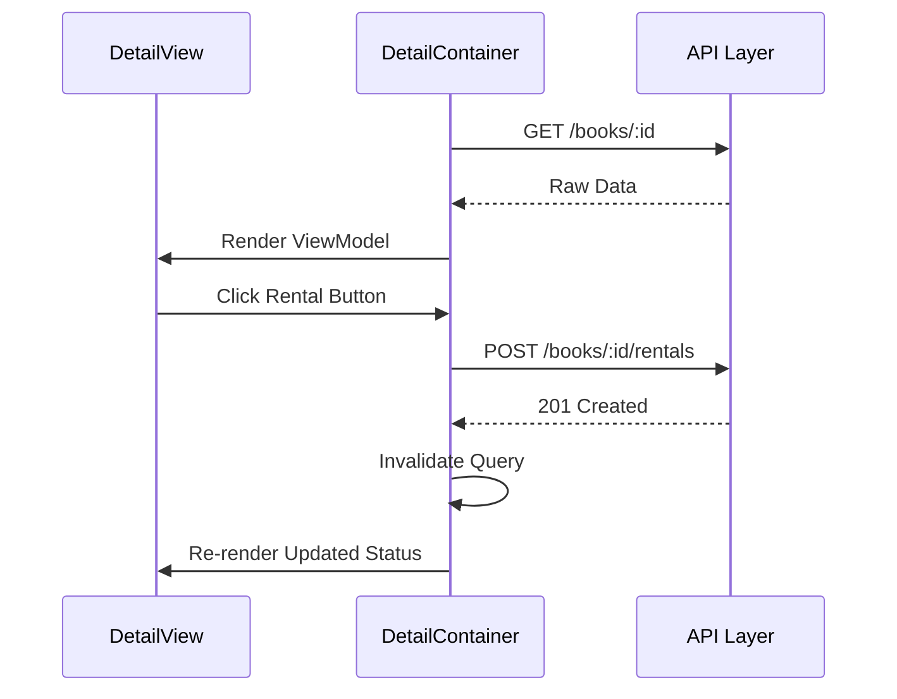

# Feature Spec: BookDetail

> [!NOTE]
> 이 문서의 구현 규칙은 [FEATURE_RULE.md](../rules/FEATURE_RULE.md)를 따릅니다.

## 1. Context & Goal
- **Problem**: 특정 도서의 상세 정보를 확인하고 대여하거나 반납할 수 있는 인터페이스가 필요함.
- **Goal**: 도서의 상세 데이터를 조회하여 표시하고, 실시간으로 대여/반납 상태를 전환할 수 있는 기능을 제공함.
- **Target Pages**: `BookDetailPage` (`/books/:id`)

## 2. Data Contract (I/O Specification)

### 2.1 API Response (Input)
```typescript
/** 서버 도서 모델 */
interface RawBookDetail {
  id: string;
  title: string;
  status: 'AVAILABLE' | 'RENTED';
}
```

### 2.2 UI Model (Output)
```typescript
/** 상세 뷰용 모델 */
interface BookDetailViewModel {
  id: string;
  title: string;
  statusLabel: string;
  actionButtonText: '대여하기' | '반납하기';
  canRent: boolean;
  canReturn: boolean;
}
```

### 2.3 Transformation Rules (Mapper)
- **status -> statusLabel**: `AVAILABLE` -> '현재 대여 가능', `RENTED` -> '현재 대여 중'
- **status -> actionButtonText**: `AVAILABLE` -> '대여하기', `RENTED` -> '반납하기'
- **canRent**: `status === 'AVAILABLE'`
- **canReturn**: `status === 'RENTED'`

## 3. Interaction & Business Logic

### 3.1 Core Business Logic
1. **상태 전환**: 대여 버튼 클릭 시 대여 처리를, 반납 버튼 클릭 시 반납 처리를 수행함.
2. **권한 체크**: (향후 확장 시) 로그인한 사용자만 대여 가능하도록 제한할 수 있음.

### 3.2 Action Handlers (Side Effects)
| Handler Name | Trigger | API/Logic | On Success | On Failure |
| :--- | :--- | :--- | :--- | :--- |
| `handleRental` | 대여 버튼 클릭 | `rentalBook(id)` | 쿼리 무효화 및 성공 Toast | 에러 알림 |
| `handleReturn` | 반납 버튼 클릭 | `returnBook(id)` | 쿼리 무효화 및 성공 Toast | 에러 알림 |

## 4. UI/UX State Definitions
- **Loading State**: 상세 정보 영역에 Skeleton UI 노출.
- **Action Pending**: 대여/반납 처리 중 버튼 내 Spinner 노출 및 중복 클릭 방지.

## 5. Technical Implementation Details
- **Feature Directory**: `src/features/BookDetail/`
- **Query Key Strategy**: `['books', 'detail', id]`
- **Invalidation Strategy**: 성공 시 상세 정보 쿼리와 `RentalHistory` 쿼리를 함께 무효화함.

## 6. Flow Diagram

