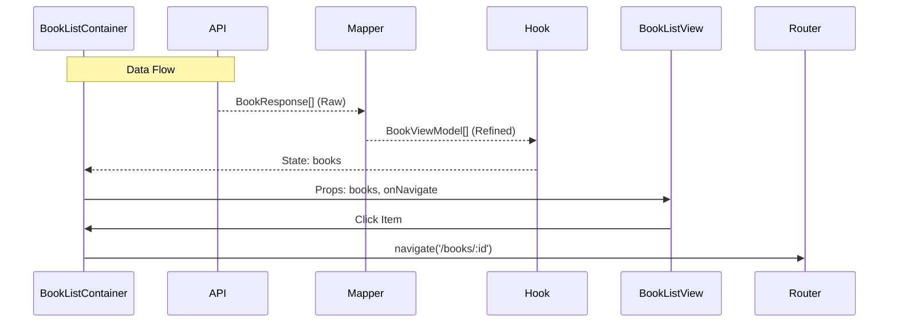

# Feature Spec: BookList

> [!NOTE]
> 이 문서의 구현 규칙은 [FEATURE_RULE.md](../rules/FEATURE_RULE.md)를 따릅니다.

## 1. Context & Goal
- **Problem**: 사용자가 시스템에 등록된 전체 도서 목록을 한눈에 파악하기 어렵고, 대여 가능 여부를 즉시 확인하기 힘듦.
- **Goal**: 도서 목록을 안정적으로 페칭하여 표시하고, 각 도서의 현재 상태(대여 가능/대여 중)를 명확히 시각화함.
- **Target Pages**: `BookListPage` (`/`)

## 2. Data Contract (I/O Specification)

### 2.1 API Response (Input)
```typescript
/** BOOK_API.md의 GET /books 응답 구조 */
interface RawBook {
  id: string;
  title: string;
  status: 'AVAILABLE' | 'RENTED';
}
```

### 2.2 UI Model (Output)
```typescript
/** 컴포넌트에서 사용하는 정제된 구조 */
interface BookViewModel {
  id: string;
  title: string;
  statusText: '대여 가능' | '대여 중';
  isRentable: boolean;
  statusColor: 'green' | 'red';
}
```

### 2.3 Transformation Rules (Mapper)
- **status -> statusText**: `AVAILABLE` -> '대여 가능', `RENTED` -> '대여 중'
- **status -> isRentable**: `AVAILABLE` 이면 `true`, 나머지는 `false`
- **status -> statusColor**: `AVAILABLE` -> `green`, `RENTED` -> `red`

## 3. Interaction & Business Logic

### 3.1 Core Business Logic
1. **목록 정렬**: 서버에서 내려온 순서를 기본으로 하되, 클라이언트에서 제목순 정렬 기능을 제공할 수 있음.
2. **상태 기반 스타일링**: 대여 중인 도서는 리스트에서 시각적으로 흐리게(Opacity) 표시하거나 별도의 배지를 부착함.

### 3.2 Action Handlers (Side Effects)
| Handler Name | Trigger | API/Logic | On Success | On Failure |
| :--- | :--- | :--- | :--- | :--- |
| `handleNavigateDetail` | 도서 카드 클릭 | `router.push('/books/:id')` | - | - |

## 4. UI/UX State Definitions
- **Loading State**: 전체 목록 영역에 Skeleton UI(카드 형태)를 노출함.
- **Empty State**: "등록된 도서가 없습니다." 메시지와 함께 '도서 등록' 버튼을 노출함.
- **Error State**: 에러 메시지와 함께 '다시 시도' 버튼 제공.

## 5. Technical Implementation Details
- **Feature Directory**: `src/features/BookList/`
- **Query Key Strategy**: `['books', 'list']`
- **Key Dependencies**: `shared/ui/Card`, `shared/ui/Badge`

## 6. Flow Diagram

