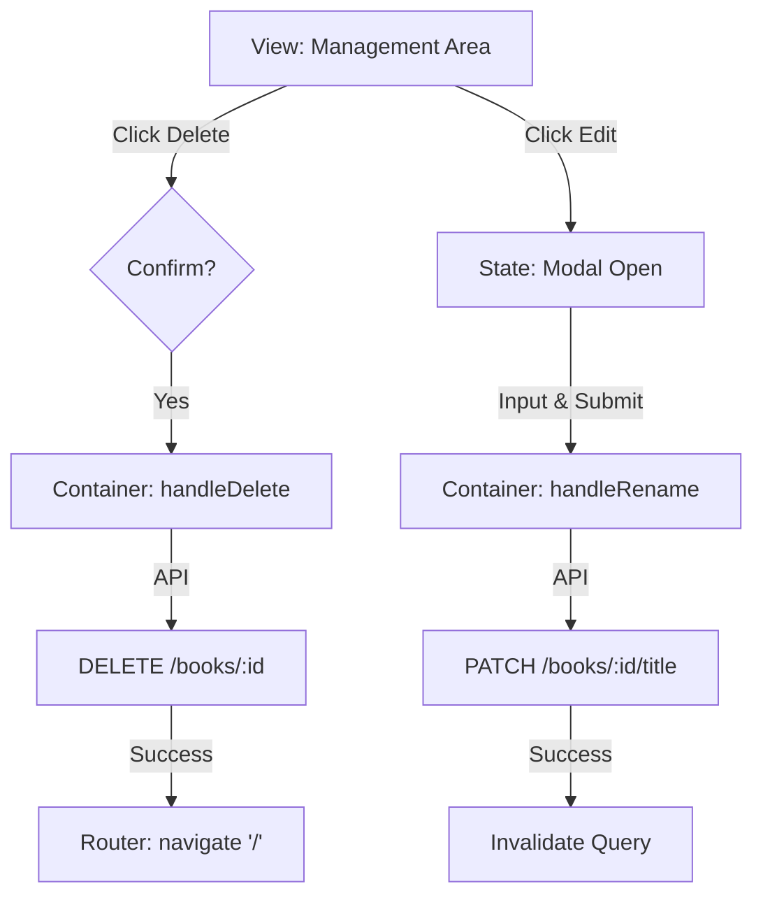

# Feature Spec: BookManagement

> [!NOTE]
> 이 문서의 구현 규칙은 [FEATURE_RULE.md](../rules/FEATURE_RULE.md)를 따릅니다.

## 1. Context & Goal
- **Problem**: 도서 정보가 잘못 입력되었거나 더 이상 서비스하지 않는 도서를 처리할 수 있어야 함.
- **Goal**: 도서 제목을 수정하거나 시스템에서 도서를 완전히 삭제하는 관리 기능을 제공함.
- **Target Pages**: `BookDetailPage` (`/books/:id`)

## 2. Data Contract (I/O Specification)

### 2.1 API Request (Input)
```typescript
/** 수정 요청 */
interface RenameBookTitleRequest {
  title: string;
}

/** 삭제 요청은 Path Param만 존재 */
```

### 2.2 UI Model (Output)
- 수정용 모달 상태 및 입력 필드 관리.

## 3. Interaction & Business Logic

### 3.1 Core Business Logic
1. **삭제 확인**: 삭제 버튼 클릭 시 즉시 삭제하지 않고, 브라우저 `confirm` 또는 커스텀 모달을 통해 사용자 확인을 거침.
2. **수정 유효성**: 수정할 제목은 빈 값일 수 없음.

### 3.2 Action Handlers (Side Effects)
| Handler Name | Trigger | API/Logic | On Success | On Failure |
| :--- | :--- | :--- | :--- | :--- |
| `handleRename` | 수정 확인 클릭 | `renameTitle(id, title)` | 쿼리 무효화 및 모달 닫기 | 에러 알림 |
| `handleDelete` | 삭제 확인 클릭 | `removeBook(id)` | 목록 페이지(`/`)로 이동 | 에러 알림 |

## 4. UI/UX State Definitions
- **Modal State**: 수정 모달의 Open/Close 상태 관리.
- **Danger Zone**: 삭제 버튼은 붉은색 계열로 강조하여 주의를 환기함.

## 5. Technical Implementation Details
- **Feature Directory**: `src/features/BookManagement/`
- **Hooks**: `useRenameBook`, `useRemoveBook` 커스텀 훅으로 로직 분리 권장.

## 6. Flow Diagram

