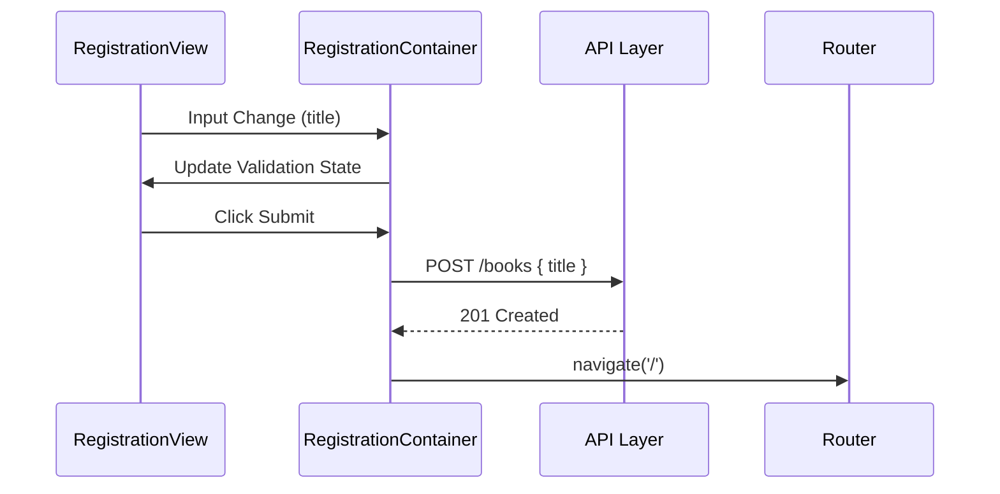

# Feature Spec: BookRegistration

> [!NOTE]
> 이 문서의 구현 규칙은 [FEATURE_RULE.md](../rules/FEATURE_RULE.md)를 따릅니다.

## 1. Context & Goal
- **Problem**: 새로운 도서를 시스템에 추가할 수 있는 직관적인 입력 수단이 필요함.
- **Goal**: 도서 제목을 입력받아 유효성을 검증하고, 서버에 성공적으로 등록한 후 목록 페이지로 이동함.
- **Target Pages**: `BookRegistrationPage` (`/books/register`)

## 2. Data Contract (I/O Specification)

### 2.1 API Request (Input)
```typescript
/** BOOK_API.md의 POST /books 요청 구조 */
interface CreateBookRequest {
  title: string;
}
```

### 2.2 UI Model (Output)
```typescript
/** Form에서 관리하는 데이터 구조 */
interface RegistrationFormValues {
  title: string;
}
```

### 2.3 Transformation Rules (Mapper)
- **FormValues -> API Request**: 1:1 매핑 (불필요한 공백 제거 처리 포함)

## 3. Interaction & Business Logic

### 3.1 Core Business Logic
1. **유효성 검증 (Validation)**:
    - 제목은 필수 입력 사항임.
    - 제목은 최소 2자 이상, 최대 100자 이하로 제한함.
2. **중복 클릭 방지**: 제출 중(isPending)일 때는 등록 버튼을 비활성화함.

### 3.2 Action Handlers (Side Effects)
| Handler Name | Trigger | API/Logic | On Success | On Failure |
| :--- | :--- | :--- | :--- | :--- |
| `handleSubmit` | 폼 제출 (Submit) | `createBook(data)` | 목록 페이지(`/`) 이동 및 Toast 알림 | 에러 메시지 노출 |

## 4. UI/UX State Definitions
- **Loading State**: 등록 버튼 내부에 Spinner 표시.
- **Error State**: 입력 필드 하단에 빨간색 에러 메시지 표시.

## 5. Technical Implementation Details
- **Feature Directory**: `src/features/BookRegistration/`
- **Mutation Strategy**: `useMutation` 사용, 성공 시 `['books', 'list']` 쿼리 무효화.
- **Form Library**: `react-hook-form` 권장.

## 6. Flow Diagram

