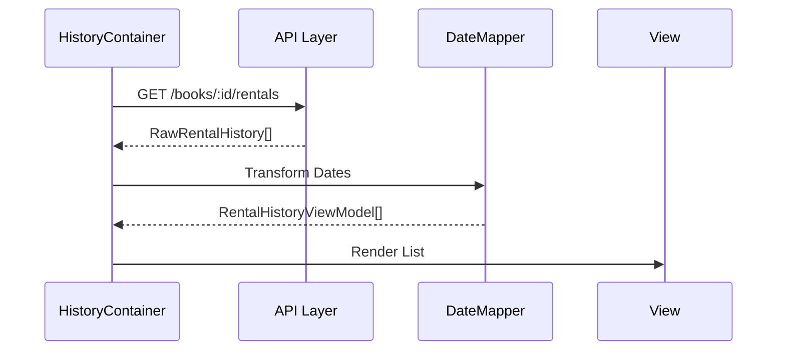

# Feature Spec: RentalHistory

> [!NOTE]
> 이 문서의 구현 규칙은 [FEATURE_RULE.md](../rules/FEATURE_RULE.md)를 따릅니다.

## 1. Context & Goal
- **Problem**: 도서가 언제 대여되고 반납되었는지에 대한 이력을 확인하고 싶어 함.
- **Goal**: 특정 도서의 전체 대여 이력을 리스트 형태로 표시하며, 날짜 정보를 읽기 쉬운 포맷으로 제공함.
- **Target Pages**: `BookDetailPage` (`/books/:id`)

## 2. Data Contract (I/O Specification)

### 2.1 API Response (Input)
```typescript
/** RENTAL_API.md의 GET /books/{id}/rentals 응답 */
interface RawRentalHistory {
  id: string;
  rentedAt: string; // ISO 8601
  returnedAt: string | null; // ISO 8601
}
```

### 2.2 UI Model (Output)
```typescript
/** 리스트 표시용 모델 */
interface RentalHistoryViewModel {
  id: string;
  rentedDateText: string; // '2024.04.27 10:00'
  returnedDateText: string; // '2024.04.27 15:00' 또는 '대여 중'
  isCurrentlyRented: boolean;
}
```

### 2.3 Transformation Rules (Mapper)
- **rentedAt -> rentedDateText**: `format(new Date(rentedAt), 'yyyy.MM.dd HH:mm')`
- **returnedAt -> returnedDateText**: 
    - `null` 이면 '대여 중'
    - 존재하면 `format(new Date(returnedAt), 'yyyy.MM.dd HH:mm')`
- **isCurrentlyRented**: `returnedAt === null`

## 3. Interaction & Business Logic

### 3.1 Core Business Logic
1. **정렬**: 대여 일시(`rentedAt`)를 기준으로 최신순으로 정렬하여 표시함.
2. **상태 시각화**: '대여 중'인 항목은 굵은 글씨나 강조 색상을 사용하여 구분함.

### 3.2 Action Handlers (Side Effects)
| Handler Name | Trigger | API/Logic | On Success | On Failure |
| :--- | :--- | :--- | :--- | :--- |
| - | - | - | - | - |
*(조회 전용 기능으로 특별한 Action Handler 없음)*

## 4. UI/UX State Definitions
- **Loading State**: 리스트 영역에 Line 형태의 Skeleton 노출.
- **Empty State**: "대여 이력이 없습니다." 메시지 노출.

## 5. Technical Implementation Details
- **Feature Directory**: `src/features/RentalHistory/`
- **Query Key Strategy**: `['books', 'rentals', bookId]`
- **Key Dependencies**: `date-fns` (날짜 포맷팅)

## 6. Flow Diagram

