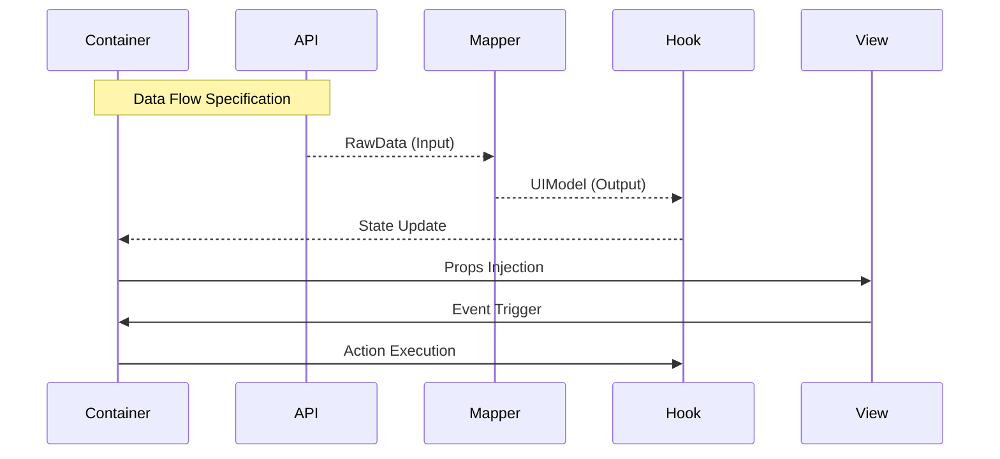

# Feature Spec: {FeatureName}

> [!NOTE]
> 이 문서의 구현 규칙은 [FEATURE_RULE.md](../rules/FEATURE_RULE.md)를 따릅니다.

## 1. Context & Goal
- **Problem**: {해결하려는 문제 및 배경}
- **Goal**: {기능 구현의 최종 목표}
- **Target Pages**: {적용될 페이지 목록}

## 2. Data Contract (I/O Specification)
AI가 `types.ts` 및 `mapper.ts`를 즉시 생성할 수 있도록 명세합니다.

### 2.1 API Response (Input)
```typescript
/** 서버에서 내려오는 원본 데이터 구조 */
interface RawData {
  // [REQUIRED] 필드명: 타입; // 설명
}
```

### 2.2 UI Model (Output)
```typescript
/** 컴포넌트에서 실제로 사용하는 정제된 구조 */
interface UIModel {
  // [REQUIRED] 필드명: 타입; // 변환 및 가공 의도
}
```

### 2.3 Transformation Rules (Mapper)
- **{RawField} -> {UIField}**: {변환 로직: 예 - ISO 날짜를 'YYYY-MM-DD'로 변환}
- **Status Mapping**: {예 - 'AVAILABLE' -> '대여 가능', 'RENTED' -> '대여 중'}
- **Default Value**: {데이터 누락 시 Fallback 처리 방침}

## 3. Interaction & Business Logic
AI가 `Container` 및 `Action Hook`의 로직을 구성할 때 참조합니다.

### 3.1 Core Business Logic
1. **{로직명}**: {조건 및 결과 - 예: 사용자의 권한이 'ADMIN'일 때만 삭제 버튼 활성화}
2. **{로직명}**: {상세 조건 및 결과}

### 3.2 Action Handlers (Side Effects)
| Handler Name | Trigger | API/Logic | On Success | On Failure |
| :--- | :--- | :--- | :--- | :--- |
| `handle{Action}` | {이벤트} | {요구사항} | {쿼리 무효화, 알림 등} | {에러 처리 방안} |

## 4. UI/UX State Definitions
AI가 `View` 컴포넌트의 조건부 렌더링을 작성할 때 참조합니다.

- **Loading State**: {Skeleton UI 사용 여부 및 범위}
- **Empty State**: {데이터가 없을 때 노출할 메시지 및 Action 버튼}
- **Error State**: {특수 에러 상황(예: 404)에서의 UI 대응}

## 5. Technical Implementation Details
- **Feature Directory**: `src/features/{featureName}/`
- **Query Key Strategy**: `['{featureName}', {params}]`
- **Shared State**: `use{Feature}Store` (Zustand 필요 시)
- **Key Dependencies**: {참조해야 할 전역 유틸리티 또는 공용 컴포넌트}

## 6. Flow Diagram (Optional)
